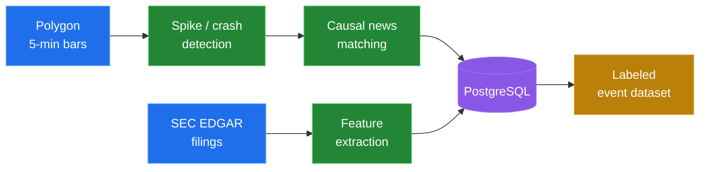

# Ahsan QaZi

### AI/ML Engineer

**I build event-driven equity research pipelines and multi-LLM systems.**

 

 

## 🎯 What I work on

Most of my work sits at one specific seam: **a stock moves sharply, and something caused it.**

Turning that into data means scraping minute bars, detecting the move statistically, finding the filing or news article responsible, and proving the link is causal rather than coincidental — at scale, with every row accounted for.

<table>
<tr>
<td width="33%" valign="top">

### 📈 Market microstructure

Robust modified z-score detection (median/MAD) over 5-min bars across ~100 tickers, with a dual statistical **and** economic gate so thresholds stay defensible.

</td>
<td width="33%" valign="top">

### 📄 Filing intelligence

SEC EDGAR filings parsed into per-filing feature rows — filing-native extraction, XBRL, and source cross-validation against a news lookback window.

</td>
<td width="33%" valign="top">

### 🤖 Multi-LLM systems

A three-seat LLM council that labels financial news against a versioned rubric, with an explicit decision layer for when the seats disagree.

</td>
</tr>
</table>

 

## 🛠️ Tech stack

**Languages**

**Data & ML**

**AI / LLM**

**Web**

**Tools & APIs**

 

## ⭐ Featured

### [Oracruit](https://github.com/IZAQ18/Oracruit) — Smart Prep for Smart Careers

An AI-powered mock interview platform. Pick a role, seniority, and tech stack; it generates a tailored question set, runs the interview as a **real-time voice conversation**, then grades the transcript under a Zod schema so feedback comes back as validated structured scores instead of free-form prose.

> My quantitative pipeline work — spike/crash detection, causal news matching, SEC feature extraction, and the multi-LLM labeling council — currently lives in private repositories. Happy to walk through the architecture and code on request.

 

## 🧭 How I build

|  | Principle |
|---|---|
| 📋 | **Statuses over silence.** Every unmatched row gets an explicit status and reason. Nothing is dropped, nothing is forced into a match it doesn't deserve. |
| ⚙️ | **Deterministic rules over LLM judgment** wherever a rule can do the job. Models handle the residual, and their disagreement is itself data. |
| 🎛️ | **Tunables in one place.** Every threshold lives in a single config, never inline. |
| 📐 | **Robust statistics by default.** Median and MAD over mean and σ — because one outlier shouldn't mask the next. |
| 📝 | **Decisions get written down** as they're made, not reconstructed afterward. |

 

### Let's talk

If you're working on market data, event detection, or LLM evaluation systems — I'd like to hear about it.

