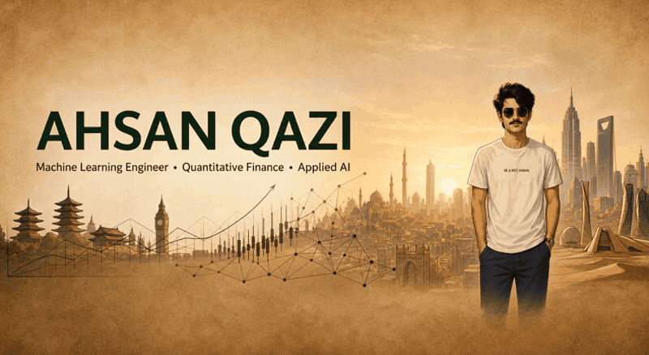
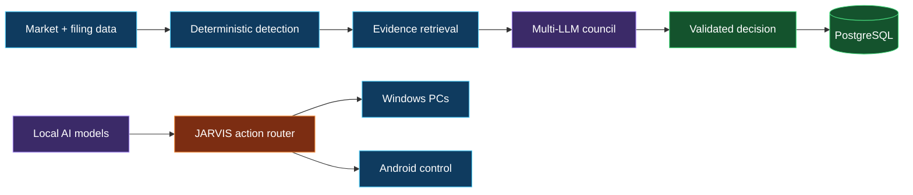

## Engineering signal

I build systems that convert noisy events into traceable decisions. My work joins quantitative research, causal evidence retrieval, multi-model reasoning, and local-first automation—with explicit statuses, measurable gates, and a human approval layer where risk demands it.

<table>
<tr>
<td width="33%" valign="top">

### Market intelligence

Intraday event detection, robust statistics, SEC filing intelligence, causal-news matching, and PostgreSQL-backed evidence pipelines.

</td>
<td width="33%" valign="top">

### Multi-LLM engineering

Independent model seats, rubric-driven labels, structured outputs, disagreement handling, validation, and human-review exports.

</td>
<td width="33%" valign="top">

### Private automation

Local AI routing, Windows orchestration, Android control, voice interaction, permission gates, and cross-device routines.

</td>
</tr>
</table>

## Languages, frameworks & tools

## System architecture

## Flagship builds

| Project | What it proves | Stack |
|---|---|---|
| [**Oracruit**](https://github.com/IZAQ18/Oracruit) | Real-time AI mock interviews with validated, structured scoring | Next.js · React · TypeScript · Firebase · Gemini |
| **4UP by IZAQ** *(private)* | Sends one verbatim workload to Claude, ChatGPT, Gemini, and DeepSeek, then captures all four responses in a resilient side-by-side console | Chrome MV3 · JavaScript · DOM orchestration |
| **JARVIS NEXUS by IZAQ** *(private)* | Natural-language Windows automation across two PCs and Android, with local-model routing and approval-gated power controls | Node.js · PowerShell · Ollama · Android |
| **EvidenceDesk** *(private)* | Evidence-centered research workflows spanning event detection, filings, news, and review | Python · PostgreSQL · LLM orchestration |
| **Catalyst pipeline** *(private)* | Matches intraday spike/crash events to the news catalyst using deterministic rules before model judgment | Python · market data · robust statistics |
| **Council labeler** *(private)* | Three independent LLM seats label financial news against a versioned rubric and expose disagreement | Python · multi-LLM · structured evaluation |

## GitHub activity

> Private work can count toward the contribution calendar without exposing its source or repository contents. I keep the graph honest: meaningful commits, reviews, issues, and shipped systems—never backdated or empty activity.

## How I build

| Principle | In practice |
|---|---|
| **Statuses over silence** | Every unmatched row receives a status and reason. Nothing disappears. |
| **Rules before model judgment** | Deterministic logic handles what can be proven; models handle the residual. |
| **Disagreement is data** | Model conflict is preserved, measured, and routed for review. |
| **Tunables live in one place** | Thresholds and policies stay versioned and auditable. |
| **Risk earns friction** | Sensitive automation requires explicit human approval. |

### Build systems that can explain themselves.

If you work on market intelligence, AI evaluation, or private automation, let's connect.

