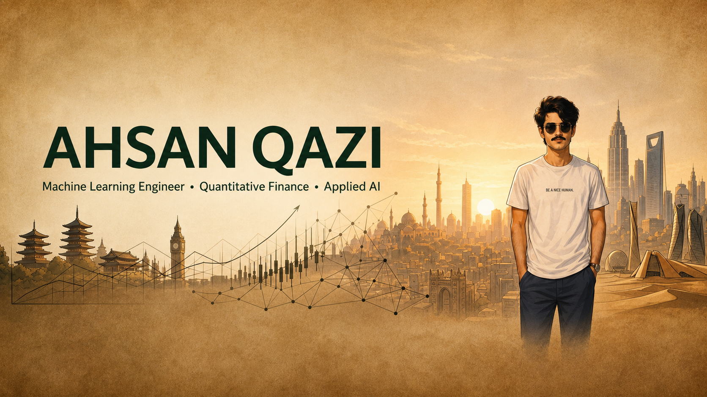
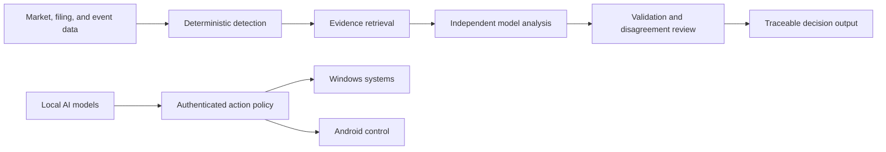

 

### Machine Learning Engineering · Quantitative Finance · Applied AI

I design evidence-led systems that turn noisy data, market events, and model outputs into decisions that can be inspected, measured, and defended.

---

## Engineering profile

My work sits at the intersection of machine learning, quantitative research, and production systems engineering. I build pipelines where every event has provenance, every model decision has context, and every operational action has a visible outcome.

<table>
<tr>
<td width="33%" valign="top">

### Quantitative systems

Intraday event detection, robust statistics, filing intelligence, catalyst attribution, and PostgreSQL-backed research pipelines.

</td>
<td width="33%" valign="top">

### Applied AI systems

Multi-model evaluation, structured outputs, disagreement analysis, evidence retrieval, validation gates, and human-review exports.

</td>
<td width="33%" valign="top">

### Private intelligence

Local model routing, Windows and Android orchestration, durable automation, voice interfaces, and authenticated cross-device control.

</td>
</tr>
</table>

## Selected engineering work

| System | Engineering focus | What it demonstrates |
|---|---|---|
| [**Oracruit**](https://github.com/IZAQ18/Oracruit) | AI interview intelligence | Real-time mock interviews with structured, validated scoring and a production web experience. |
| **EvidenceDesk** · private | Evidence-centered market research | Connects event detection, SEC filings, causal news, model review, and traceable research outputs. |
| **4UP by IZAQ** · private | Multi-model operations | Sends one unchanged workload to four independent model seats and captures each response in a resilient comparison console. |
| **JARVIS NEXUS by IZAQ** · private | Local-first intelligence mesh | Coordinates local Qwen models, two Windows systems, and Android through authenticated routines and cross-device execution. |
| **Catalyst pipeline** · private | Quantitative event attribution | Matches intraday spike and crash events to candidate catalysts with deterministic rules before model judgment. |
| **Council labeler** · private | LLM evaluation infrastructure | Preserves independent labels, confidence, citations, and disagreement against a versioned financial-news rubric. |

## System design

The recurring design pattern is deliberate: deterministic rules establish what can be proven, models address the ambiguous remainder, and validation protects the final output.

## Technical practice

## Engineering principles

| Principle | Standard |
|---|---|
| **Evidence before assertion** | Claims retain their source, time, and transformation history. |
| **Rules before model judgment** | Deterministic logic handles the provable layer; models handle ambiguity. |
| **Statuses over silence** | Every item ends with an outcome, reason, or explicit unresolved state. |
| **Disagreement is information** | Model conflict is preserved, measured, and routed for review. |
| **Controls match consequences** | Authentication, auditability, and failure behavior scale with operational risk. |

## GitHub activity

> Public and private engineering activity is represented honestly: meaningful commits, reviews, issues, and shipped systems—never backdated or empty contributions.

---

### Build systems that can explain themselves.

Open to conversations around quantitative research infrastructure, applied AI, model evaluation, and private intelligence systems.

